<h1 align="center">
   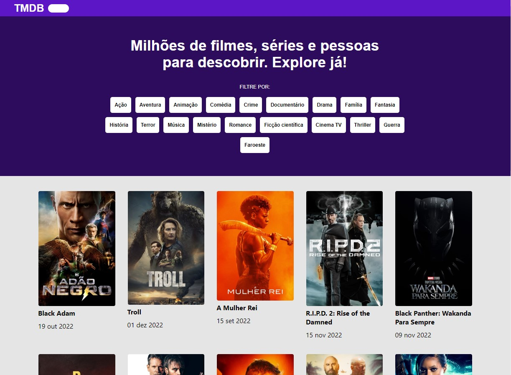
</h1>

<br/>

## Projeto Locadora

Este projeto é baseado em um case da [Promobit](https://github.com/Promobit/front-end-challenge), um desafio que visa criar um site de busca de filmes, onde é possível ver uma listagem enorme de filmes, com muitas paginas de opções, sendo possível filtrar os filmes por gênero e também entrar na pagina de cada filme para saber os detalhes dele, como elenco, trailer e outras informações.

---

<br/>

## Funcionalidades
- 500 paginas com 20 filmes cada estão disponíveis.
- É possível entrar em na pagina de detalhes de cada filme.
- É possível filtrar os filmes da página atual por gêneros, ou combinação deles, como por exemplo uma comédia romantica ou outras variantes.
- Na página de detalhes de cada filme é possível assistir o trailer do mesmo, algumas vezes o trailer esta indisponível por conta do retorno da API.

---

<br/>

## Link funcional

Parte do desafio era utilizar uma API pronta, a TMDB (The Movie DataBase), uma API muito complexa e cheia de Endpoits. Neste projeto foram utilizadas requisições muito expecificas, e para isso foi necessário uma API_KEY disponibilizada ao criar cadastro na pagina da API, mas caso você queira testar as funções dessa aplicação basta acessar o link abaixo.

---

<br/>

## 📦 Implantação

Caso você queira instalar este projeto em sua maquina e fazer alguma modificação ou teste, pode clonar o projeto ou baixar o arquivo zip aqui pelo GitHub.

```bash
   # Clonar o repositório
   $ git clone https://github.com/matheus92as/

```
Após baixar ou clonar o projeto, abra a pasta principal dele pelo terminal e instale as bibliotecas já disponíveis no package.json

```bash
   #Instalar bibliotecas já escritas no package.json
   $ npm i
```

Estamos quase la, para que as requisições dessa aplicação funcionem corretamente, é necessario que você tenha uma API_KEY, esta chave é única para cada usuario cadastrado na TMDB, sendo assim realize seu cadastro e consiga sua chave.

 As instruções estão todas neste link, leia com calma e não terá problemas.

## [Introdução api_key](https://developers.themoviedb.org/3/getting-started/introduction)

Depois que estiver com sua chave, crie um arquivo .env na pasta raiz do seu projeto, e la dentro crie uma variavel da seguinte forma:

```javascript
    REACT_APP_API_KEY = chaveAdquiridaNoTMDB
```

É importante que o nome da variavel seja este, pois as requisições já estão prontas para recebe-lá desta forma.

Agora sim, podemos executar nossa pagina e testar na pratica suas funções, basta executar o comando no terminal:

```bash
    #Rodar aplicação Frontend
    $ npm start
```

---

<br/>

## Imagens

Este projeto teve seu design definido, então o layout foi disponibilizado no Figma, as imagens a seguir são o resultado da aplicação feita com os moldes sugeridos.

### [Design Proposto](https://www.figma.com/file/rM7WPqhLY9ObnGzSCeWLxB/Teste-Front-End?node-id=0%3A1&t=q1F14sWPT6odKrxz-0)

<br/>

## Versão Desktop

<br/>

<h1 align="center">
   
</h1>

<h1 align="center">
   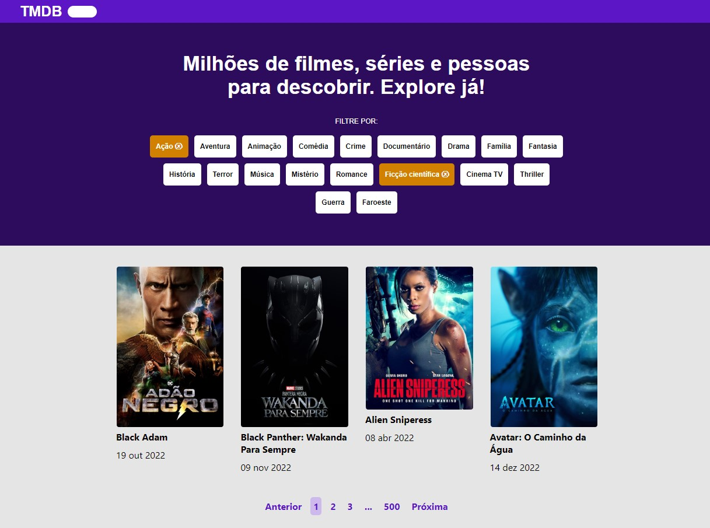
</h1>

<h1 align="center">
   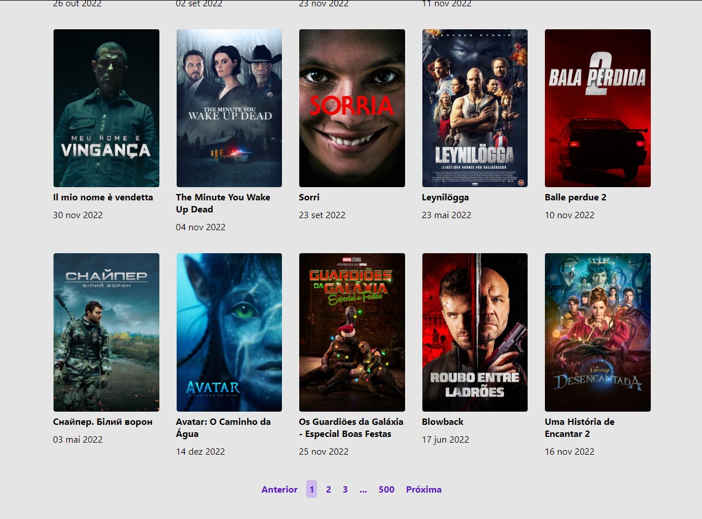
</h1>

<h1 align="center">
   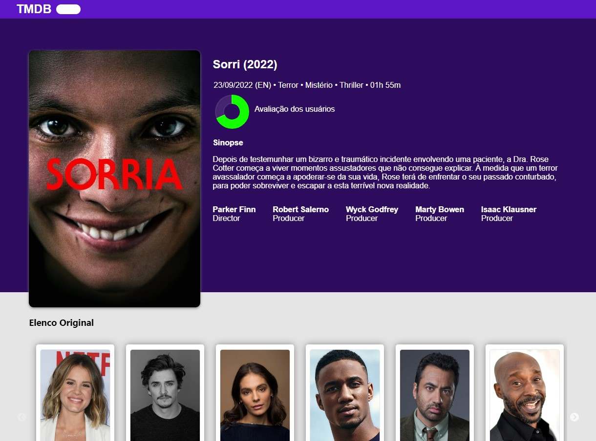
</h1>

<h1 align="center">
   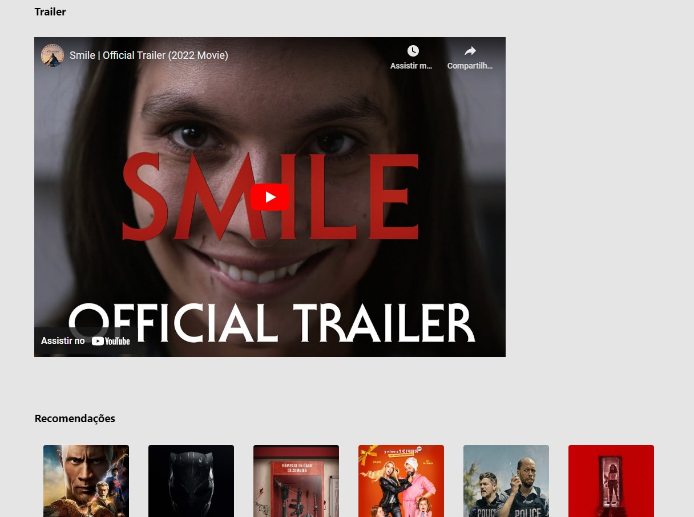
</h1>


Pagina extra, para casos de pagina não encontrada:
<h1 align="center">
   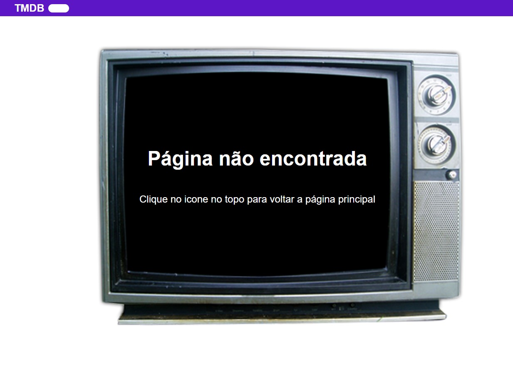
</h1>

## Versão Mobile, baseada no modelo iPhone 12 Pro

<br/>

Home
<h1 align="center">
   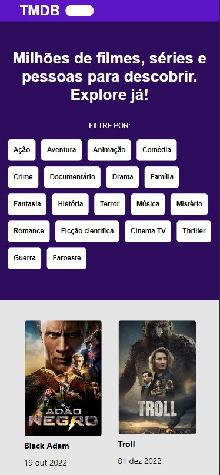
   
   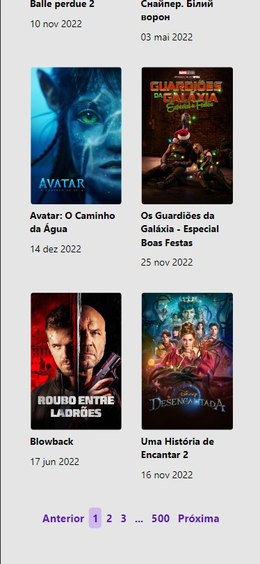
</h1>

Detalhes
<h1 align="center">
   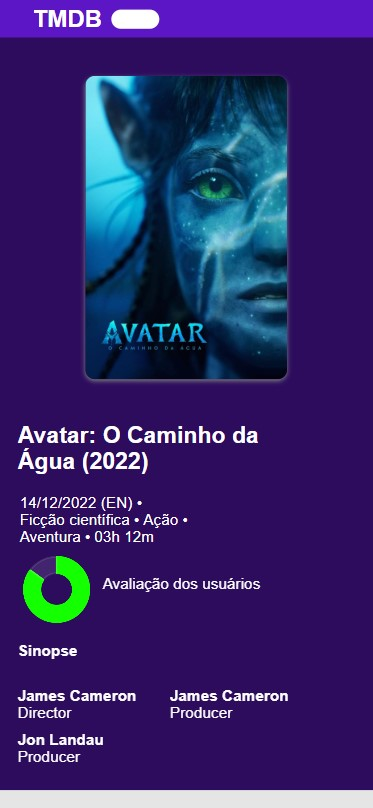
   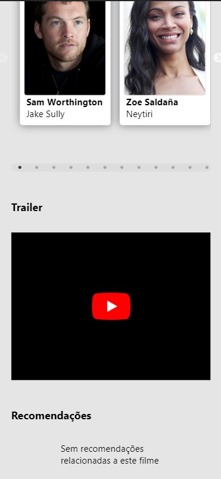
</h1>

Pagina extra, para casos de pagina não encontrada:
<h1 align="center">
   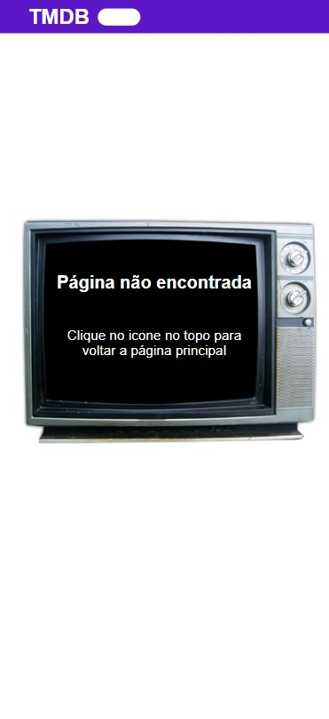
</h1>


